<div align="center">



<br/>

<a href="https://github.com/CaptainAlpha04">
  
</a>
<a href="https://www.linkedin.com/in/muhammad-ai/">
  
</a>

</div>

<br/>

```txt
$ whoami
> Senior Software Engineer & Systems Architect.
> I ship AI-native products and then interrogate them about free will.
> Currently arguing with a compiler and a theologian, simultaneously.
```

<br/>

### 🧑‍🚀 Pilot Dossier

<div align="center">

</div>

<br/>

### ⚙️ Stack

<div align="center">


</div>

### 🌌 Wired into

<div align="center">
&nbsp;&nbsp; Agentic AI & LLM systems &nbsp;·&nbsp; Distributed system architecture &nbsp;·&nbsp; Theoretical physics &nbsp;·&nbsp; Speculative-fiction worldbuilding &nbsp;·&nbsp; Philosophy & theology &nbsp;·&nbsp; Game & simulation design
</div>

<br/>

### 📡 Mission Telemetry

<div align="center">

</div>

<br/>

### 🛰️ Mission Log

<div align="center">

</div>

<br/>

### 🐍 Snake, eating my commits

<div align="center">
  
</div>

<br/>

<div align="center">

</div>

